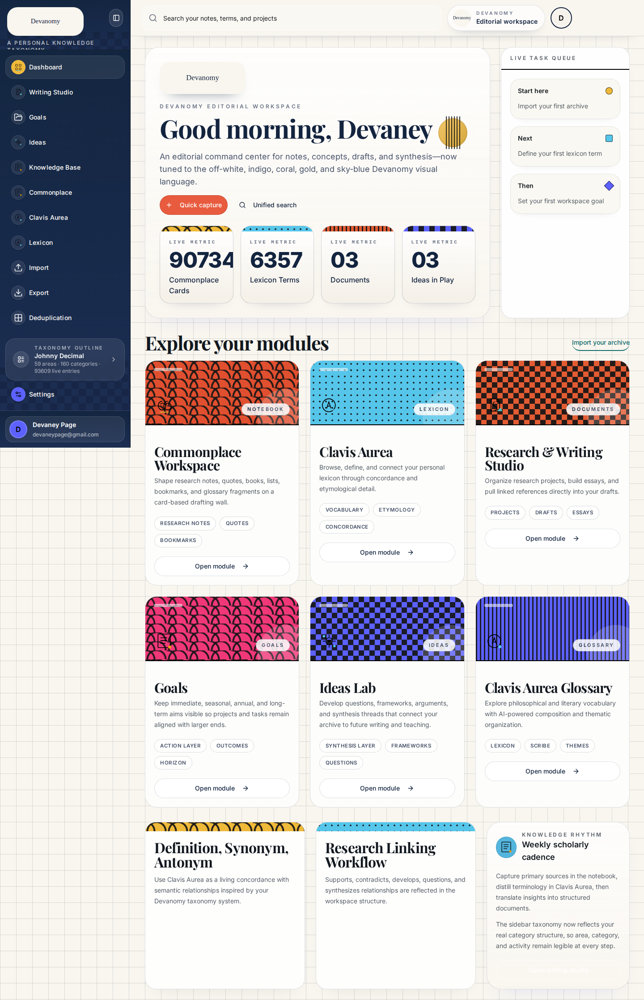

# Devanomy Performance and Pre-release Hardening Verification

**Author:** Manus AI  
**Date:** 2026-08-12  
**Canonical verification:** 2026-08-25  
**Status:** Local and canonical GitHub Actions quality gates passed

## Executive Summary

Devanomy now bounds ordinary Notebook reads, loads page code only when a route is requested, and carries a repository-native pre-release quality gate. The previously measured 4.7-second unbounded Notebook list was replaced by a 25-item paginated response that completed in 192 milliseconds against the same live archive, a **95.9% latency reduction** and **24.4× speedup**. The complete archive remains available through a deliberately separate `notebook.exportAll` procedure, requested only when an export is initiated.[1]

Route-level lazy loading reduced the initial JavaScript entry from 2,037,171 bytes to 777,898 bytes, a **61.8% reduction**. Fifteen page imports are now dynamic and Vite emitted fourteen dynamic chunks; Notebook and Commonplace legitimately share one implementation chunk.[2]

## Implemented Architecture

| Area | Previous behavior | Current behavior |
|---|---|---|
| Notebook listing | Every matching record was selected, serialized, transferred, and parsed | `notebook.list` returns `items` plus `pageInfo`, with page sizes constrained to 1–100 |
| Dashboard count | Downloaded the archive and counted its array length | Requests one record and reads the filtered database total from `pageInfo.total` |
| Reference pickers | Requested the entire Notebook archive | Request only the first 25 recent or matching records |
| Export | Loaded the complete Notebook archive whenever the Export route mounted | Calls `notebook.exportAll` only after the user selects Notebook and activates export |
| Page delivery | Every registered page was imported into the initial application graph | Fifteen page modules use `React.lazy` with an accessible route-local `Suspense` fallback |
| Bundle regression control | No automated route-chunk assertion | Vite emits a manifest; `check:bundle` verifies dynamic imports and enforces a 1.2 MB initial-entry ceiling |
| Release automation | An obsolete npm/Webpack matrix failed on every push | A pnpm/Node 22 workflow runs the complete suite on pull requests, manual dispatch, and Sundays at 06:00 UTC |

## Verification Results

The successful local quality gate ran against the existing application database while replacing Forge LLM and storage services with deterministic local equivalents. All temporary CRUD records and Commonplace fixtures were cleaned by the suite. Browser verification covered every registered route and recorded no page exceptions, console errors, failed requests, or HTTP error responses.[1]

| Verification layer | Result |
|---|---:|
| TypeScript check | Passed |
| Vitest files | 30 passed |
| Vitest tests | 295 passed |
| Production build | Passed |
| Lazy route declarations | 15 verified |
| Emitted dynamic route chunks | 14 verified |
| tRPC procedures inventoried and covered | 83 of 83 |
| HTTP checks | 106 of 106 passed |
| Authenticated browser routes | 17 of 17 passed |
| Browser diagnostics | 0 errors |
| Canonical GitHub Actions run | Passed in 2m31s |

## Measured Performance

| Operation | Baseline | Current | Change |
|---|---:|---:|---:|
| Ordinary Notebook list | 4,700 ms | 192 ms | 95.9% faster; 24.4× speedup |
| Search-scoped Notebook page | Unbounded | 228 ms | Bounded to 10 records in the endpoint workflow |
| Explicit full Notebook export | Previously coupled to ordinary list loading | 5,021 ms | Preserved but deferred until an intentional export action |
| Initial JavaScript entry | 2,037,171 bytes | 777,898 bytes | 1,259,273 bytes smaller; 61.8% reduction |

The full export remains computationally expensive because it intentionally transfers the complete archive. The architectural improvement is that routine dashboard, picker, route, and endpoint activity no longer pays that cost.

## Pre-release Quality Gate

The new **Pre-release Quality Gate** uses a disposable MySQL 8.4 service and applies the canonical Drizzle schema. It installs dependencies with pnpm 11 under Node 22, installs Chromium, seeds an isolated CI owner, runs deterministic Forge-compatible LLM and storage mocks, and executes `pnpm test:webapp`. The workflow uploads endpoint results and browser evidence even when a run fails.[3]

The workflow runs in three circumstances: on pull requests targeting `main`, on explicit manual dispatch, and every Sunday at 06:00 UTC. Concurrency cancellation prevents superseded runs on the same ref from wasting runner time. No production credentials or user data are required.

The first weekly scheduled run correctly detected a stale Commonplace regression that still expected the former `Inbox` / `In Motion` / `Shaping` / `Archive` seed labels after the product adopted six numbered canonical columns. The test was made deterministic by validating the exported canonical seed definition separately from the persistent-data router snapshot. The repaired canonical manual run, **32817398969**, then completed successfully in 2 minutes 41 seconds. It passed dependency installation, pinned Python Playwright and Chromium installation, disposable database schema application, all 295 tests, the complete application quality gate, and verification-evidence upload.[4]

## Evidence

## References

[1]: ./performance-release-hardening-results-2026-08-12.json "Complete endpoint and browser verification results"
[2]: ./performance-release-hardening-bundle-2026-08-12.json "Route splitting and initial bundle measurements"
[3]: ../../.github/workflows/pre-release-quality-gate.yml "Pre-release Quality Gate workflow"
[4]: https://github.com/devaneypage/devasophy-pkm/actions/runs/32817398969 "Successful repaired canonical Pre-release Quality Gate run"
