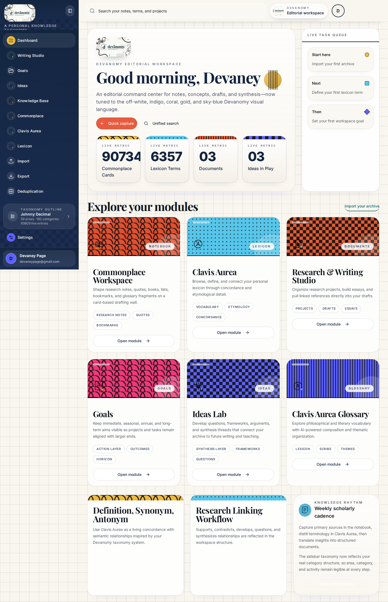

# Devanomy Web-App Endpoint Verification

**Author:** Manus AI  
**Verification date:** 12 August 2026  
**Project:** `devasophy-pkm`

## Executive Result

The complete web-app verification suite now passes. The final run covered **all 82 registered tRPC procedures**, executed **104 HTTP assertions**, loaded **all 17 registered frontend routes in authenticated Chromium**, passed **291 Vitest regressions across 29 test files**, completed TypeScript validation, and produced a successful production build.[1] [2] [3]

The suite initially uncovered two production-significant defects: the deduplication scan could not complete against the current dataset, and the Glossary route crashed when it received the actual Lexicon API shape. Both defects were corrected, regression-tested, and reverified through the full HTTP and browser workflow.[4] [5] [6] [7]

| Verification layer | Final result | Evidence |
|---|---:|---|
| TypeScript validation | Passed | `pnpm check` in the reusable suite |
| Vitest regression suite | 29 files; 291 tests passed | `pnpm test` in the reusable suite |
| Production build | Passed | Vite client build and esbuild server bundle |
| tRPC procedure inventory | 82 of 82 covered | Final endpoint result dataset |
| HTTP assertions | 104 of 104 passed | Final endpoint result dataset |
| Browser route smoke tests | 17 of 17 passed | Chromium route matrix |
| Browser page errors | 0 | Chromium diagnostics |
| Browser console errors | 0 | Chromium diagnostics |
| Failed browser requests | 0 | Chromium diagnostics |

## Test Method

The endpoint runner first inventories the live `appRouter`, which prevents silent omissions when procedures are added or renamed.[2] It then launches the production build on an isolated local port, creates an authenticated owner session, and exercises public, protected, query, mutation, CRUD, search, import, AI-assistance, feature-flag, Commonplace, and deduplication contracts through the real HTTP adapter.[2] [3]

Mutating procedures use uniquely named temporary records. The suite deletes those records after verification, including Commonplace boards and snapshots that do not expose a user-facing delete procedure. Deduplication resolution is exercised as a **same-module Lexicon merge**, preserving the architecture rule that true merges remain within a module; cross-module resolution remains an archive-or-delete review flow.[2] [4]

The owner-notification endpoint is deliberately tested with a validation failure rather than dispatching an external notification. This verifies routing, input validation, and error serialization without generating an unsolicited alert. AI-backed research and Scribe procedures are called successfully with minimal prompts.[1] [2]

## Defects Found and Corrected

### 1. Deduplication scan timeout

The original scan compared every record with every other record and applied comparatively expensive string-distance calculations. Against **6,364 current records**, this implied **20,247,066 pair comparisons**; the endpoint exceeded the 120-second client timeout.[9]

The implementation now generates candidates with exact identifier buckets plus two bounded sorted-neighborhood passes over normalized titles. Exact Zettelkasten identifiers and same-module UUIDs remain globally matched, while fuzzy comparisons are limited to lexically proximate candidates.[4] A live-scale regression containing 6,364 normalized records confirms that duplicate groups are still detected without restoring quadratic all-pairs work.[5]

The final live HTTP call returned **HTTP 200 in 7.725 seconds**.[1] This is a substantial operational recovery, though it remains the slowest endpoint in the suite and should be treated as a performance-sensitive path.

### 2. Glossary route runtime crash

The Glossary page expected `word`, while the Lexicon API returns `term`; nullable definitions also reached unguarded lowercase filtering. This produced a browser exception on `/glossary`.[6]

The page now normalizes `term` to `word`, converts nullable definitions to safe strings, and initializes the Scribe mutation hook during render rather than invoking a hook inside an event handler.[6] New component regressions cover both the real Lexicon field shape and Scribe invocation.[7] The final Chromium run loaded `/glossary` successfully with no page or console errors.[1]

## Endpoint Coverage

| Procedure family | Coverage approach |
|---|---|
| System and authentication | Health success and validation failure, anonymous identity, authenticated identity, logout cookie behavior, unauthorized protected access |
| Feature flags | List plus idempotent update of the existing Commonplace flag value |
| Notebook, Lexicon, Documents | Reversible create, list, get, update, delete; linked references and semantic links |
| Goals, Projects, Tasks, Ideas | Reversible full CRUD workflows |
| Taxonomy and Zettelkasten | Read operations, seed operation, and identifier generation |
| Search | Authenticated unified search against a unique no-match marker |
| Commonplace | Bootstrap, list, real board creation, real snapshot creation, reversible column and entry workflows, reorder, move, update, and delete |
| Deduplication | Live scan plus reversible same-module Lexicon merge resolution |
| Bulk import and duplicate detection | Empty-input no-op imports and real duplicate-detection queries/batches |
| Autofill | Isolated Quotes and Clavis Aurea fixtures supplied through the production server configuration |
| AI assistance | Real Document Research Assistant and Glossary Scribe calls |
| Owner notification | Non-dispatching validation probe to avoid an unsolicited external alert |

## Browser Route Matrix

The authenticated browser smoke test loaded the dashboard, Commonplace aliases, Notebook, Lexicon, Documents, Goals, Ideas, Bulk Import, Search, detail routes, Glossary, Export, Deduplication, the explicit 404 route, and an unknown fallback route. Every navigation returned HTTP 200, avoided the login gate and error boundary, and produced no page errors, console errors, or failed network requests.[1]



## Performance Observations

| Endpoint | Final elapsed time | Interpretation |
|---|---:|---|
| `deduplication.scan` | 7.725 s | Corrected from timeout; still performance-sensitive |
| `notebook.list` | 4.692 s | Functional but a pagination/indexing candidate |
| `bulkImport.detectNotebookDuplicates` | 1.276 s | Functional; dataset-size dependent |
| `featureFlags.list` | 0.900 s | Functional |
| `glossary.composeWithScribe` | 0.767 s | External AI call completed successfully |

These values are single-run local integration measurements, not load-test percentiles.[1]

## Reproduction

The project now exposes a durable one-command suite:

```bash
pnpm test:webapp
```

This command runs TypeScript validation, all Vitest tests, the production build, procedure inventory, isolated authenticated HTTP checks, and Chromium route diagnostics.[3] [8]

## Residual Non-Blocking Findings

The production build emits a Vite warning for JavaScript chunks larger than 500 kB; the primary application bundle is approximately 2.04 MB before gzip. This does not break endpoint behavior, but route-level code splitting should be considered as a separate performance improvement. The server also emits an Express deprecation warning because logout passes `maxAge` to `clearCookie`; this is compatible today but should be removed before an Express 5 migration.

## Conclusion

All currently registered application procedures and routes are functioning under the verified test conditions. The suite is repeatable, guards against endpoint-inventory drift, uses reversible test data, and now includes regressions for the two defects discovered during this run.

## References

[1]: ./full-endpoint-results-2026-08-12.json "Final endpoint and browser result dataset"
[2]: ../../scripts/verify-all-endpoints.py "Authenticated HTTP and Chromium endpoint suite"
[3]: ../../scripts/run-webapp-test-suite.sh "Reusable full web-app suite runner"
[4]: ../../server/duplicateDetection.ts "Deduplication candidate-generation implementation"
[5]: ../../server/deduplicationWorkspace.test.ts "Live-scale deduplication regression"
[6]: ../../client/src/pages/Glossary.tsx "Glossary API normalization and Scribe integration"
[7]: ../../client/src/pages/Glossary.test.tsx "Glossary component regressions"
[8]: ../../package.json "Project test scripts"
[9]: ./deduplication-baseline-2026-08-12.json "Measured pre-fix deduplication baseline"
